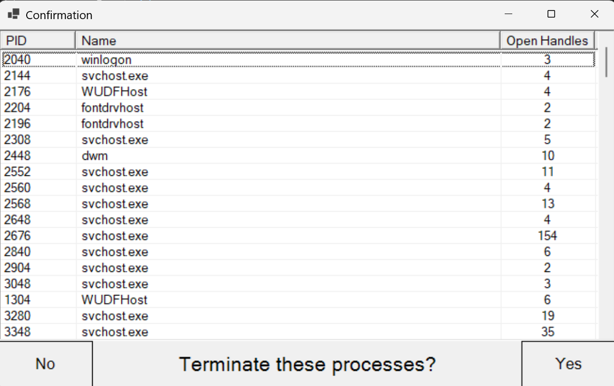

# FileOrFolderInUse
This is a [WinForms](https://learn.microsoft.com/en-us/dotnet/desktop/winforms/overview) Graphical User Interface made in C# that integrates the [Microsoft's Sysinternals Handle](https://learn.microsoft.com/en-us/sysinternals/downloads/handle) to identify processes using a file or directory, with the option to close them.

## Context Menu Integration
Add the following registry entries:
- `HKEY_CLASSES_ROOT\*\shell\FileOrFolderInUse` with default ("") value set to `Show file handles`
- `HKEY_CLASSES_ROOT\*\shell\FileOrFolderInUse\command` with default ("") value set to `"C:\Path\To\FileOrFolderInUse.exe" "%1"`
- `HKEY_CLASSES_ROOT\Directory\shell\FileOrFolderInUse` with default ("") value set to `Show folder handles`
- `HKEY_CLASSES_ROOT\Directory\shell\FileOrFolderInUse\command` with default ("") value set to `"C:\Path\To\FileOrFolderInUse.exe" "%1"`

### How to use
1. Download Handle v5.0 from https://learn.microsoft.com/en-us/sysinternals/downloads/handle and place `handle.exe`, `handle64.exe`, `handle64a.exe` in the same folder as `FileOrFolderInUse.exe`.
2. Specify one or more (files or directories) to inspect:
```powershell
FileInUse "C:\Path\To\File.txt" "C:\Path\To\Directory"
```
3. Confirm Yes or No to close these processes or not. <br><br>

### To build the source code
Ensure you have .NET 10 SDK installed from https://dotnet.microsoft.com/en-us/download/dotnet/10.0

Then, open up Powershell in the repository root directory and run the following command:
```powershell
dotnet publish -c Release
```

## AGPL-3.0 license
Source: https://www.gnu.org/licenses/agpl-3.0.en.html

This is an [OSI-approved](https://opensource.org/licenses?ls=GNU+Affero+General+Public+License+version+3) open-source license. Free to fork, modify, and redistribute under the terms of the AGPL-3.0.

By complying with the AGPL-3.0 license, you must keep the same license for the covered work and cannot relicense that covered part under a different license.
Anyone who receives the software (including through purchase or as a service) must also be provided access to the corresponding source code under the same license.

See the [LICENSE.txt](https://github.com/KiyomizuSuzu/FileInUse/blob/main/LICENSE.txt) for the full license text.
